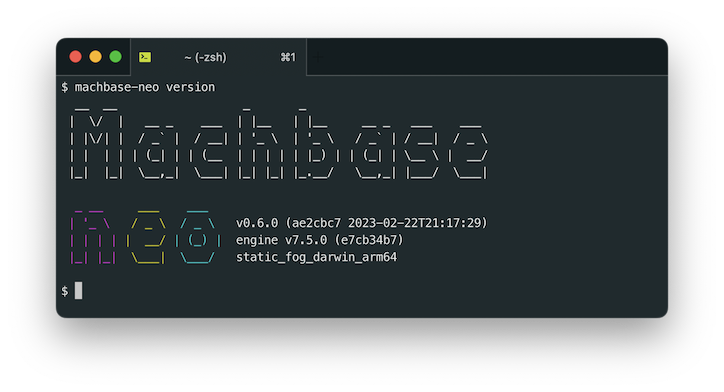

# Operations
{: .no_toc}

1. TOC
{: toc }

## Change default password

Change default password for security before allowing remote access.

```sh
machbase-neo shell "ALTER USER SYS IDENTIFIED BY my_password"
```

{:.note-title}
> Escape from OS shell
>
> When execute SQL statement in non-interactive mode on command line like above example,
> OS shell's special characters should be escaped.
> For example, if we execute `machbase-neo shell select * from table` without quotation marks.
> '*' will be interpreted by bash (or zsh) as 'all files'.
> `\`, `!`, `$` and quotation marks should be carefully used for the same reason.
>
> Or we can execute command in neo-shell interactive mode.
> Execute `machbase-neo shell` then it will show prompt `machbase-neo >>`.
> In interactive mode with machbase-neo prompt, no more shell escaping is required.

## Bind Address

Machbase Neo run and listen only localhost by default for security reasons. If sensors that run remotely need to send data to Machbase Neo through TCP/IP network, Machbase Neo requires to start with listen address with `--host <bind address>` option.

To allow listening from all addresses, use `0.0.0.0`

```sh
machbase-neo serve --host 0.0.0.0
```

To allow listening from specific address, set the IP address of the host.

```sh
machbase-neo serve --host 192.168.1.10
```

## Listening Ports

| flag (long)     | default      | desc                                                      |
|:----------------|:-------------|:----------------------------------------------------------|
| `--mach-port`   | 5656         | machbase native port for JDBC/ODBC drivers                |
| `--grpc-port`   | 5655         | gRPC port                                                 |
| `--http-port`   | 5654         | HTTP port                                                 |
| `--mqtt-port`   | 5653         | MQTT port                                                 |
| `--shell-port`  | 5652         | for ssh, open `machbase-neo shell` prompt remotely        |


## Connect from remote

machbase-neo supports ssh interface for the remote operation and administration.
Users can access the sql interpreter via ssh command like below.

- User: SYS
- Default password: manager

```sh
$ ssh -p 5652 sys@127.0.0.1
sys@127.0.0.1's password: manager↵
```

Then after `machbase-neo» ` prompt, users can query with SQL statements.

```
machbase-neo» select * from example;
┌─────────┬──────────┬─────────────────────────┬───────────┐
│ ROWNUM  │ NAME     │ TIME(UTC)               │ VALUE     │
├─────────┼──────────┼─────────────────────────┼───────────┤
│       1 │ wave.sin │ 2023-01-31 03:58:02.751 │ 0.913716  │
│       2 │ wave.cos │ 2023-01-31 03:58:02.751 │ 0.406354  │
│       3 │ wave.sin │ 2023-01-31 03:58:03.251 │ 0.978235  │
│       4 │ wave.cos │ 2023-01-31 03:58:03.251 │ 0.207502  │
│       5 │ wave.sin │ 2023-01-31 03:58:03.752 │ 1.000000  │
│       6 │ wave.cos │ 2023-01-31 03:58:03.752 │ -0.000838 │
│       7 │ wave.sin │ 2023-01-31 03:58:04.251 │ 0.978060  │
│       8 │ wave.cos │ 2023-01-31 03:58:04.251 │ -0.208321 │
│       9 │ wave.sin │ 2023-01-31 03:58:04.751 │ 0.913375  │
│      10 │ wave.cos │ 2023-01-31 03:58:04.751 │ -0.407119 │
│      11 │ wave.sin │ 2023-01-31 03:58:05.251 │ 0.808771  │
│      12 │ wave.cos │ 2023-01-31 03:58:05.251 │ -0.588124 │
│      13 │ wave.sin │ 2023-01-31 03:58:05.751 │ 0.668819  │
│      14 │ wave.cos │ 2023-01-31 03:58:05.751 │ -0.743425 │
└─────────┴──────────┴─────────────────────────┴───────────┘
```

### Use public key authentication with SSH

Adding the public key to machbase-neo server makes it possible to execute any `machbase-neo shell` command without prompt and entering password.

#### Add your public key to server
{:.no_toc}

```sh
machbase-neo shell ssh-key add `cat ~/.ssh/id_rsa.pub`
```

#### Get list of registered public keys
{:.no_toc}

```sh
machbase-neo shell ssh-key list
```

```
 machbase-neo shell ssh-key list
┌────────┬────────────────────────────┬─────────────────────┬──────────────────────────────────┐
│ ROWNUM │ NAME                       │ KEY TYPE            │ FINGERPRINT                      │
├────────┼────────────────────────────┼─────────────────────┼──────────────────────────────────┤
│      1 │ myid@laptop.local          │ ssh-rsa             │ 80bdaba07591276d065ca915a6037fde │
│      2 │ myid@MacStudio.local       │ ecdsa-sha2-nistp256 │ e300ee460b890ad4c22cd4c1eae03477 │
└────────┴────────────────────────────┴─────────────────────┴──────────────────────────────────┘
```

#### Remove registered public key
{:.no_toc}


```sh
machbase-neo shell ssh-key del <fingerprint>
```

### Execute commands via SSH

We can execute any machbase-neo shell command remotely only with `ssh`.

```sh
$ ssh -p 5652 sys@127.0.0.1 'select * from example order by time desc limit 5'↵

 ROWNUM  NAME      TIME(UTC)            VALUE     
──────────────────────────────────────────────────
 1       wave.sin  2023-02-09 11:46:46  0.406479  
 2       wave.cos  2023-02-09 11:46:46  0.913660  
 3       wave.sin  2023-02-09 11:46:45  -0.000281 
 4       wave.cos  2023-02-09 11:46:45  1.000000  
 5       wave.cos  2023-02-09 11:46:44  0.913431  
```

## Command line

### machbase-neo serve

Start machbase-neo server process.

#### Flags
{:.no_toc}

| flag (long)     | flag (short) | desc                                                      |
|:----------------|:-------------|:----------------------------------------------------------|
| `--config`      | `-c`         | config file location                                      |
| `--pid`         |              | file path to save pid. ex) `--pid /data/machbase-neo.pid` |


### machbase-neo shell

Start machbase-neo shell. It will start interactive mode shell if there are no other arguments.

#### Flags
{:.no_toc}

| flag (long)     | flag (short) | desc                                                      |
|:----------------|:-------------|:----------------------------------------------------------|
| `--server`      | `-s`         | machbase-neo's gRPC address. <br/> default: `--server tcp://127.0.0.1:5655` <br/> e.g. `-s unix://./mach-grpc.sock` |


### machbase-neo version

Show version, edition and engine info.



### machbase-neo gen-config

Prints out default config template.

```
$ machbase-neo gen-config ↵

define DEF {
    LISTEN_HOST       = flag("--host", "127.0.0.1")
    SHELL_PORT        = flag("--shell-port", "5652")
    MQTT_PORT         = flag("--mqtt-port", "5653")
    HTTP_PORT         = flag("--http-port", "5654")
    GRPC_PORT         = flag("--grpc-port", "5655")
......
```
