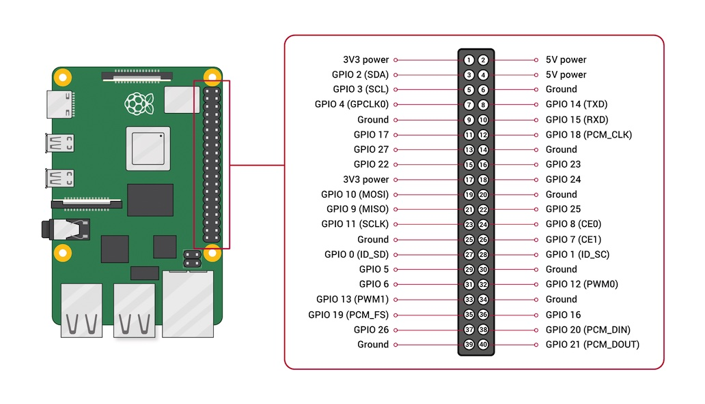
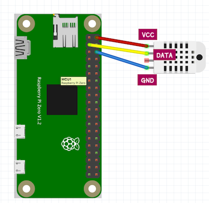
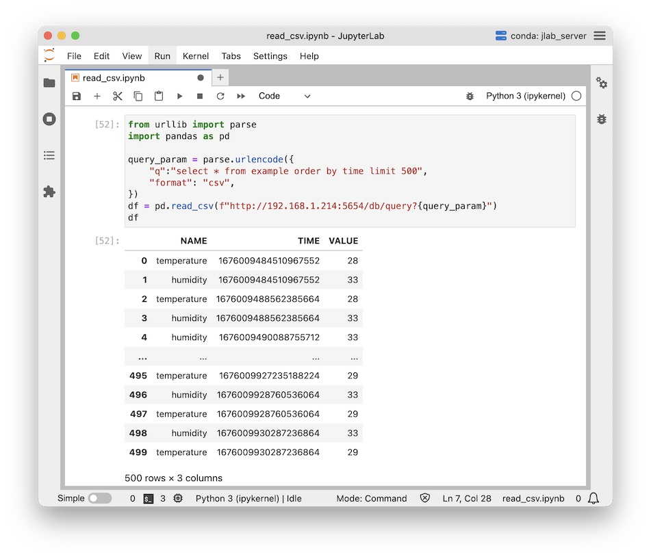

# Raspberry PI as IoT server

This tutorial covers a demonstration for installing machbase-neo on Raspberry PI, collecting and retrieving sensor data.

- Raspberry PI 4 model B (4GB Mem in this tutorial)
- Adafruit_DHT 11 (sensor)


## Install machbase-neo

- Connect to PI via SSH or console

```
$ ssh -l pi <ip address>
```

- Make `demo` directory

```sh
mkdir demo && cd demo
```

- Download machbase-neo (edge edition for arm64)

```sh
sh -c "$(curl -fsSL https://neo.machbase.com/assets/install.sh)"
```

- Unarchive zip file

```sh
$ unzip machbase-neo-edge-v{version}-linux-arm64.zip
$ cd machbase-neo-edge-v{version}-linux-arm64
```

- Start machbase-neo

```sh
./machbase-neo serve
```


Press `Ctrl+C` to shutdown machbase-neo.

## Bind ip address for accessing out side of Raspberry PI

As machbase-neo's boot message, it is listening only localhost(127.0.0.1).
If you are going to access data remotely (e.g via HTTP) from your laptop and other application server,
It is required to bind host ip address with `--host <bind_ip_addr>` option.

```sh
./machbase-neo serve --host 0.0.0.0
```

## Connect DHT11

Before you connect DHT11 sensor into Raspberry PI's gpio, turn off Raspberry PI first.



DHT11 has 3 leads - VCC, DAT, GND connect each lead to gpio 2, 3, 6.




## Read sensor data

Install `Adafruit_DHT` python module for accessing sensor data.

```sh
pip3 install Adafruit_DHT
```

The code reads data from the GPIO 2 pin (`pinnum = 2`), which is connected to the DAT lead of the DHT11 sensor.
It outputs the data in the form of "name, timestamp, value" every second to the standard output.
To ensure that machbase-neo can handle the time with nano-second precision,
the sample code sets the timestamp using multiplication by 1000000000.

```py
import Adafruit_DHT
from time import time
from time import sleep

pinnum = 2
sensor = Adafruit_DHT.DHT11
while (True):
    hum, temp = Adafruit_DHT.read_retry(sensor,pinnum)
    ts_ns = int(time() * 1000000000)
    if hum is not None and temp is not None:
        print(f'temperature,{ts_ns},{temp}')
        print(f'humidity,{ts_ns},{hum}')
        sleep(1)
```

Save this code as `dht.py` and execute dry-run.

```sh
$ python dht.py
temperature,1676008535430951936,28.0
humidity,1676008535430951936,33.0
temperature,1676008536956561152,28.0
humidity,1676008536956561152,33.0
temperature,1676008538482078464,28.0
humidity,1676008538482078464,33.0
temperature,1676008540007633664,28.0
humidity,1676008540007633664,33.0
^C
```

## Write sensor data into machbase neo

### Create table `example`

While `machbase-neo serve` is running, create `example` table by the shell command below.

```
./machbase-neo shell "create tag table EXAMPLE (name varchar(100) primary key, time datetime basetime, value double)"
```

### Write data

Execute `dht.py` and redirect its output to `machabse-neo shell import`.
Import command accepts csv format as default and continuously write to the specified table (here `example`).

```sh
python dht.py | ./machbase-neo shell import example
```

Since we redirect python's standard output into `machbase-neo shell import` command by pipe `|`, there will be no output message.

## Read data 

### Read recently written data

While running wrting process, open another terminal and run sql the check the recently written data.

The option `--tz local` is for displaying TIME field in local time zone instead of UTC.

```
./machbase-neo shell walk --tz local 'select * from example order by time desc'
```

Press 'r' key to re-execute query to refresh new data.


### Read data from application

Since machbase-neo provides HTTP API for application to the query stored data, it is easy requesting HTTP query data with SQL like below.

```py
from urllib import parse
import pandas as pd
query_param = parse.urlencode({
    "q":"select * from example order by time limit 500",
    "format": "csv",
})
df = pd.read_csv(f"http://192.168.1.214:5654/db/query?{query_param}")
df
```



